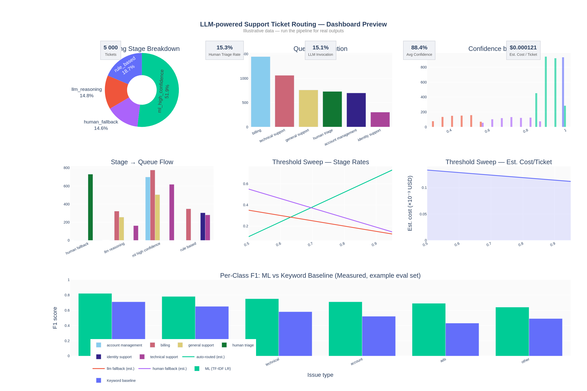

# LLM-powered Support Ticket Routing System

Author: **Allen Xu**

An end-to-end **support operations routing system** that combines deterministic rules, calibrated ML classifiers, and LLM fallback to route support tickets into operational queues, with configurable confidence thresholds and human-safe fallback.

Built as a portfolio-grade project for **Business Data Scientist / gDATA-style** roles, emphasizing measurable lift over baselines, operating-threshold tradeoffs, and cost-aware decisioning.

### Routing stages

## Dashboard Preview



> **Note:** The dashboard preview is for demonstration. Run `streamlit run app.py` after the pipeline to view outputs from your local run. To update this image, save a screenshot to `assets/dashboard_preview.png`.

The dashboard shows:

| Section | What it displays |
|---|---|
| KPI tiles | Ticket count, human triage rate (manual review proxy), LLM invocation rate, avg confidence, estimated cost/ticket |
| Routing Stage Breakdown | Pie chart of rule-based / ML high-confidence / LLM reasoning / human fallback shares |
| Queue Distribution | Bar chart of final queue assignments |
| Confidence Distribution | Histogram by routing stage |
| Stage → Queue Flow | Parallel-categories view of routing paths |
| Threshold Sweep | Estimated auto-route / LLM-fallback / human-fallback rates and cost vs. threshold (analytic, not measured) |
| Measured Eval Artifacts | Accuracy, macro-F1, per-class metrics, confusion matrix — **only when `data/eval/eval_tickets.csv` exists** |
| Human-Fallback Enrichment | Suggested resolution path, escalation flag, reason, summary — only when `--enrich-human-with-llm` was used |
| Live Routing Demo | Paste any ticket text, route it instantly; optional "Enrich human fallback with LLM guidance" checkbox |

---

## Quick Demo

```bash
# 1. Install
python -m venv .venv && source .venv/bin/activate
pip install -e .

# 2. Set credentials (Kaggle required for --download; OpenAI required for LLM stages)
export KAGGLE_USERNAME="your_username"
export KAGGLE_KEY="your_key"
export OPENAI_API_KEY="your_openai_key"
export OPENAI_MODEL="gpt-4.1-mini"   # optional, defaults to gpt-4.1-mini

# 3. Run the full pipeline (downloads data, trains, routes, exports artifacts)
python scripts/run_pipeline.py --download

# 4. Launch the dashboard
streamlit run app.py

# 5. Optional: apply custom thresholds (pick values from outputs/threshold_sweep.csv)
python scripts/run_pipeline.py --high-threshold 0.80 --low-threshold 0.50

# 6. Optional: custom thresholds + LLM enrichment for human-fallback tickets
#    (adds suggested_path, should_escalate, reason, llm_summary — costs extra LLM calls)
python scripts/run_pipeline.py --high-threshold 0.80 --low-threshold 0.50 --enrich-human-with-llm
```

> **Note:** `--download` requires Kaggle API credentials (`~/.kaggle/kaggle.json` or env vars). If data is already present locally, omit `--download`.

---

## Why this project is credible

- **Inbound-only training data**: Twitter agent messages are filtered out; only real customer-authored messages are retained.
- **Real label extraction**: structured ticket fields (`Ticket Type`, `Ticket Priority`) are mapped into issue/urgency labels — not synthetic keyword heuristics.
- **Baseline comparison**: ML vs keyword heuristic on a committed labeled eval set, with accuracy, macro/weighted F1, per-class tables, and confusion matrices.
- **Honest metric semantics**: measured, estimated, and proxy metrics are clearly separated (see below).
- **Calibrated confidence scores**: isotonic calibration on logistic regression for reliable threshold gating.
- **Batched ML inference** for routing throughput.
- **LLM failure safety**: parse/API failures fall back to `human_triage_queue`.

---

## Metric semantics

This project uses three clearly distinct metric types:

### Measured metrics
Computed against a ground-truth labeled set (`data/eval/eval_tickets.csv`). Only available when that file exists.

- `ml_accuracy`, `keyword_baseline_accuracy`
- `ml_macro_f1`, `ml_weighted_f1` and their lifts over the keyword baseline
- Per-class precision / recall / F1
- Confusion matrices for ML model and keyword baseline

### Estimated metrics
Computed analytically from ML confidence scores — no live LLM calls, no ground-truth labels.

- LLM cost per ticket: `infra_cost + llm_invocation_rate × per_call_cost`
- Threshold sweep stage rates (`auto_routed_rate_estimated`, `llm_fallback_rate_estimated`, `human_fallback_rate_estimated`) and `cost_per_ticket_usd_estimated`
- **Threshold recommendation score**: a weighted policy objective. The recommendation is a cost–coverage tradeoff guide, not an automatically applied setting. Apply via `--high-threshold` / `--low-threshold`.

### Proxy / heuristic metrics
- **`human_triage_rate`**: fraction of tickets routed to `human_triage_queue`. This is a routing-system metric, not a true production escalation rate. True escalation would require downstream tracking of which human-triaged tickets were escalated further.
- **`complexity`**: bucketed by word-count thresholds (`low` / `medium` / `high`). This is a text-length heuristic proxy, not independently labeled or validated as semantic complexity.

---

## System architecture

```text
Rule-based exact patterns (fast path)
          ↓
ML classifier — high-confidence auto-route
          ↓
LLM classification — low-confidence issue-type resolution
          ↓
Human triage — uncertain or LLM-unavailable
```

### Routing stages

1. **Rule-based**: deterministic patterns in `RULE_PATTERNS` (centralized in `config.py`).
2. **ML high-confidence**: TF-IDF + Logistic Regression (calibrated) routes when `confidence ≥ high_threshold`.
3. **LLM classification** (low-confidence band): LLM performs **issue-type classification** and returns a JSON result used to assign the queue. This is a classification call, not resolution guidance.
4. **Human fallback**: middle-confidence ambiguity and LLM failures route to `human_triage_queue`.

Urgency appends `_priority` to queues (e.g., `billing_queue_priority`) for `high`/`critical` tickets.

**Optional human-fallback enrichment** (`--enrich-human-with-llm`): separately calls `llm_resolution_and_escalation()` and `llm_summarize_ticket()` for human-fallback tickets to add `suggested_path`, `should_escalate`, `reason`, and `llm_summary` to the output. Incurs additional LLM calls; disabled by default.

---

## Data sources

### 1) Customer Support on Twitter (Kaggle)
- Slug: `thoughtvector/customer-support-on-twitter`
- Provides real customer language in noisy conversational format.
- **Only inbound customer-authored messages are retained**.

### 2) Customer Support Ticket Dataset (Kaggle)
- Slug: `suraj520/customer-support-ticket-dataset`
- Provides large-scale ticket text + structured metadata.
- `Ticket Type` → issue-type labels; `Ticket Priority` → urgency labels.

---

## Project structure

| File | Purpose |
|---|---|
| `src/llm_support_routing/data.py` | Ingestion, Kaggle download, unified schema, inbound filtering, structured-label mapping |
| `src/llm_support_routing/features.py` | Text normalization, real-label-first + keyword fallback label generation |
| `src/llm_support_routing/models.py` | TF-IDF + LR training, isotonic calibration, CV diagnostics, inference |
| `src/llm_support_routing/routing.py` | Cascade routing engine (`rule → ml → llm → human`), urgency suffixing, batched API |
| `src/llm_support_routing/llm.py` | LLM classify/summarize/enrich with resilient JSON parsing and error sentinel |
| `src/llm_support_routing/evaluation.py` | Routing KPIs, labeled-set eval vs keyword baseline, threshold sweep |
| `scripts/run_pipeline.py` | End-to-end: load → unify → label → train → evaluate → route → export |
| `scripts/train_distilbert.py` | Optional DistilBERT fine-tuning path |
| `app.py` | Streamlit dashboard |
| `data/eval/eval_tickets.csv` | Committed labeled eval set (100 rows, 6 issue types) |

> You can add `assets/dashboard_preview.png` after running the pipeline locally and relaunching Streamlit.

## Artifacts generated

```
data/processed/unified_labeled_tickets.csv
models/issue_type_tfidf_lr.joblib
models/urgency_tfidf_lr.joblib
models/complexity_tfidf_lr.joblib
outputs/routed_tickets.csv
outputs/routing_metrics.csv
outputs/threshold_sweep.csv
outputs/routing_policy_recommendation.csv   # analytic estimate — not auto-applied
outputs/training_report.txt
```

Generated only when `data/eval/eval_tickets.csv` exists (stale versions removed otherwise):
```
outputs/eval_comparison.csv          # accuracy + macro/weighted F1
outputs/eval_per_class_metrics.csv   # per-class precision/recall/F1
outputs/eval_confusion_matrix.csv    # confusion matrix
```

---

## Evaluation methodology

### A) Held-out + cross-validation (during training)
For each target (`issue_type`, `urgency`, `complexity`):
- Held-out accuracy from train/test split
- 5-fold CV mean ± std

### B) ML vs keyword baseline (measured, eval set required)
When `data/eval/eval_tickets.csv` is present:
- `ml_accuracy`, `keyword_baseline_accuracy`, accuracy lift
- Macro-F1 and weighted-F1 for both models, with lifts
- Per-class precision / recall / F1 tables
- Confusion matrices

Answers: **Does ML add measurable signal over hand-written keywords?**

### C) Confidence threshold sweep (estimated, analytic)
Generates a cost–coverage operating curve over thresholds 0.50–0.95 using ML confidence scores only (no LLM calls).

Outputs: auto-route rate, LLM fallback rate, human fallback rate, cost/ticket estimate, and a weighted recommendation score.

The recommended threshold is a **cost–coverage policy guide**, not an automatically applied value. Apply via `--high-threshold` and `--low-threshold`.

---

## Dashboard

```bash
streamlit run app.py
```

See **Dashboard Preview** at the top for a full panel description.

---

## Portfolio framing

- Built a 4-stage support ticket routing cascade (configurable rules, calibrated TF-IDF + LR, confidence-gated LLM classification, human triage) with urgency-based priority queuing and LLM failure safe-fallback.
- Improved training data quality by filtering inbound-only customer messages and mapping real issue/priority labels from structured ticket metadata, with `label_source` provenance tracking across sources.
- Implemented ML-vs-keyword baseline evaluation with accuracy, macro/weighted F1, per-class metrics, and confusion matrix artifacts; added threshold sweep for cost–coverage tradeoff analysis with parameterized recommendation scoring.

---

## Next high-ROI improvements

1. Larger hand-labeled eval set (500–2 000 rows) for more reliable per-class F1 estimates.
2. Calibration/reliability plots to validate threshold semantics.
3. SLA-aware threshold policies per queue (e.g., stricter gates for high-risk queues).
4. Persist run metadata (dataset hash, model version, git SHA) per artifact for reproducibility.
5. Empirical latency benchmarks (p50/p95 per 1k tickets) for each routing mode.
