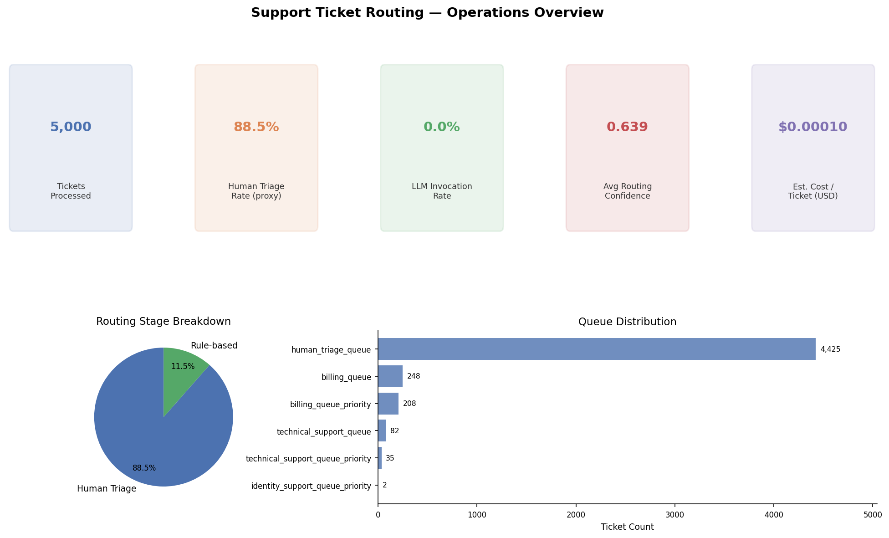
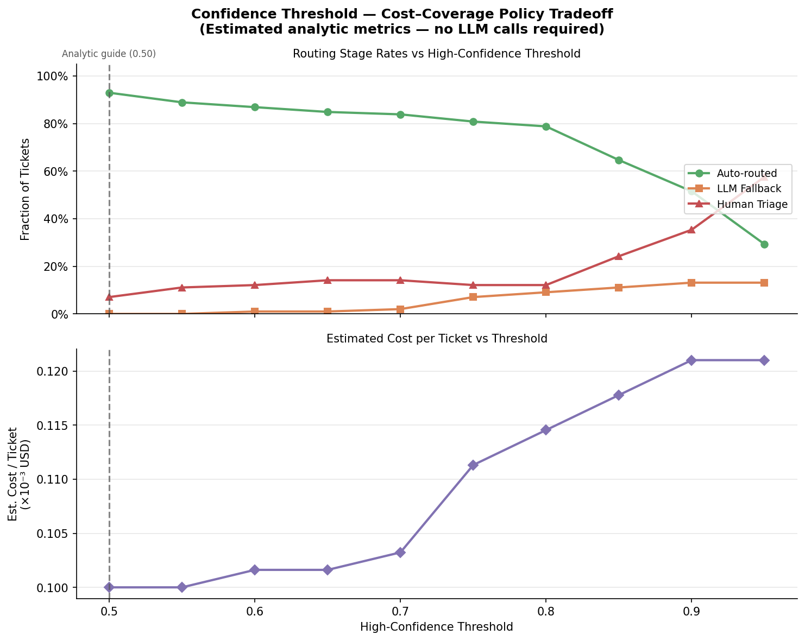
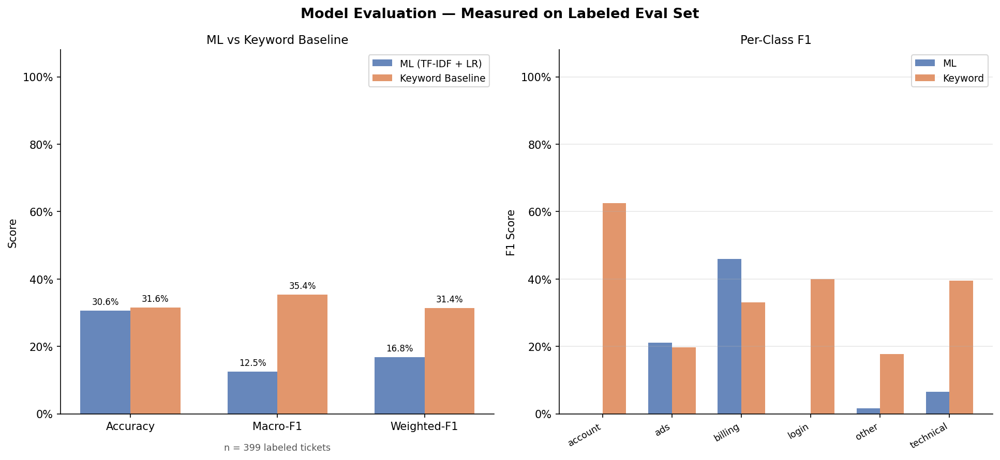

# LLM-powered Support Ticket Routing System

**Live Case Study: [portfolio-site-wheat-nu.vercel.app](https://portfolio-site-wheat-nu.vercel.app)**

Author: **Allen Xu**

An end-to-end **support operations routing system** that combines deterministic rules, calibrated ML classifiers, and LLM fallback to route support tickets into operational queues, with configurable confidence thresholds and human-safe fallback.

Built as a portfolio-grade project for **Business Data Scientist / gDATA-style** roles, emphasizing measurable lift over baselines, operating-threshold tradeoffs, and cost-aware decisioning.

**This is a support operations routing system, not a conversational chatbot.** It simulates a gTech / Google Ads-style support workflow using public datasets: incoming tickets are classified and routed to the correct queue through a four-stage cascade — deterministic rules, calibrated ML, LLM issue-type classification for ambiguous cases, and human triage as a safety net.

**Problem it solves:** Support teams need to route cases quickly and safely. Fully manual triage is costly; LLM-only routing is expensive and hard to control. This project makes the tradeoffs between automation coverage, human review load, LLM invocation cost, and routing accuracy explicit and measurable.

For a deeper explanation of design choices, evaluation strategy, operational tradeoffs, and limitations, see [docs/case_study.md](docs/case_study.md).

## Visual Preview

These previews are generated from real pipeline outputs using the two public Kaggle datasets (`thoughtvector/customer-support-on-twitter` and `suraj520/customer-support-ticket-dataset`). Run `python scripts/run_pipeline.py --download` then `python scripts/generate_preview_assets.py` to reproduce them.

### 1. Operations Overview



Shows ticket volume, human triage rate (manual review proxy), LLM invocation rate, average routing confidence, estimated cost per ticket, routing stage distribution, and queue distribution.

### 2. Cost–Coverage Policy Tradeoff



Shows how confidence thresholds shift tickets between auto-routing, LLM fallback, and human triage. These are estimated analytic metrics computed from ML confidence scores only — no LLM calls required.

### 3. Model Evaluation



Supervised benchmark on 1,665 held-out tickets (stratified 80/20 split from 8,325 deduplicated Kaggle rows). Labels come from `Ticket Type` metadata only — not model predictions or keyword heuristics. Three classes are present in the raw data: `billing`, `technical`, `other`.

| Model | Accuracy | Macro-F1 | Weighted-F1 |
|---|---|---|---|
| Keyword baseline | 23.2% | 12.1% | 20.4% |
| ML baseline (TF-IDF unigrams + LR) | 59.4% | 26.0% | 45.4% |
| ML improved (TF-IDF bigrams + char n-grams + balanced LR) | 39.3% | **33.2%** | 41.1% |

**The improved lightweight ML benchmark outperforms the keyword baseline across accuracy, macro-F1, and weighted-F1 on the held-out metadata-derived benchmark, while absolute scores remain modest and should be interpreted cautiously.** ML baseline's high accuracy (59%) reflects predicting the majority class (billing); the improved model trades raw accuracy for better class balance. The public Kaggle ticket dataset contains templated fields and metadata-derived labels, which may not fully reflect real production support traffic.

The supervised benchmark uses the classes reliably present in the structured Kaggle Ticket Type metadata (`billing`, `technical`, `other`). The broader routing taxonomy supports six issue types, but not all classes are reliably represented in this raw metadata source.

The Streamlit dashboard (`streamlit run app.py`) provides interactive versions of all panels, plus a live routing demo for pasting ticket text directly.

---

## What to look at

- **Human Triage Rate**: manual-review load proxy; lower is better only if routing quality is maintained.
- **LLM Invocation Rate**: cost-control metric; this project deliberately limits LLM use to low-confidence cases.
- **ML vs Keyword Baseline**: measured test of whether ML adds signal beyond hand-written heuristics.
- **Threshold Sweep**: estimated cost–coverage policy guide; useful for selecting an operating point, not a claim of optimality.
- **Per-Class F1**: shows which support categories the model handles well or poorly.

---

## Quick Demo

```bash
# 1. Install
python -m venv .venv && source .venv/bin/activate
pip install -e .

# 2. Set credentials (Kaggle required for --download; OpenAI only needed for LLM fallback/enrichment stages)
#    OpenAI is NOT required for benchmark generation or threshold sweep.
export KAGGLE_USERNAME="your_username"
export KAGGLE_KEY="your_key"
export OPENAI_API_KEY="your_openai_key"   # optional — only needed if LLM fallback or --enrich-human-with-llm is invoked
export OPENAI_MODEL="gpt-4.1-mini"        # optional, defaults to gpt-4.1-mini

# 3. Run the full pipeline (downloads data, trains, routes, exports artifacts)
python scripts/run_pipeline.py --download

# 4. Launch the dashboard
streamlit run app.py

# 5. Optional: apply custom thresholds (pick values from outputs/threshold_sweep.csv)
python scripts/run_pipeline.py --high-threshold 0.80 --low-threshold 0.50

# 6. Optional: custom thresholds + LLM enrichment for human-fallback tickets
#    (adds suggested_path, should_escalate, reason, llm_summary — costs extra LLM calls)
python scripts/run_pipeline.py --high-threshold 0.80 --low-threshold 0.50 --enrich-human-with-llm
```

> **Note:** `--download` requires Kaggle API credentials (`~/.kaggle/kaggle.json` or env vars). If data is already present locally, omit `--download`.

---

## Why this project is credible

- **Inbound-only training data**: Twitter agent messages are filtered out; only real customer-authored messages are retained.
- **Real label extraction**: structured ticket fields (`Ticket Type`, `Ticket Priority`) are mapped into issue/urgency labels — not synthetic keyword heuristics.
- **Baseline comparison**: ML vs keyword heuristic evaluated on both a committed metadata-derived eval set and a clean supervised held-out benchmark; reports accuracy, macro/weighted F1, per-class tables, and confusion matrices. Labels are metadata-derived, not human-reviewed production labels.
- **Honest metric semantics**: measured, estimated, and proxy metrics are clearly separated (see below).
- **Calibrated confidence scores**: isotonic calibration on logistic regression for reliable threshold gating.
- **Batched ML inference** for routing throughput.
- **LLM failure safety**: parse/API failures fall back to `human_triage_queue`.

---

## Metric semantics

This project uses three clearly distinct metric types:

### Measured metrics
Computed against a labeled evaluation set or metadata-derived held-out benchmark labels (`data/eval/eval_tickets.csv` / supervised benchmark). These labels are metadata-derived unless explicitly human-reviewed. Only available when the eval file exists.

- `ml_accuracy`, `keyword_baseline_accuracy`
- `ml_macro_f1`, `ml_weighted_f1` and their lifts over the keyword baseline
- Per-class precision / recall / F1
- Confusion matrices for ML model and keyword baseline

### Estimated metrics
Computed analytically from ML confidence scores — no live LLM calls, no ground-truth labels.

- LLM cost per ticket: `infra_cost + llm_invocation_rate × per_call_cost`
- Threshold sweep stage rates (`auto_routed_rate_estimated`, `llm_fallback_rate_estimated`, `human_fallback_rate_estimated`) and `cost_per_ticket_usd_estimated`
- **Threshold recommendation score**: a weighted policy objective. The recommendation is a cost–coverage tradeoff guide, not an automatically applied setting. Apply via `--high-threshold` / `--low-threshold`.

### Proxy / heuristic metrics
- **`human_triage_rate`**: fraction of tickets routed to `human_triage_queue`. This is a routing-system metric, not a true production escalation rate. True escalation would require downstream tracking of which human-triaged tickets were escalated further.
- **`complexity`**: bucketed by word-count thresholds (`low` / `medium` / `high`). This is a text-length heuristic proxy, not independently labeled or validated as semantic complexity.

---

## System architecture

```text
Rule-based exact patterns (fast path)
          ↓
ML classifier — high-confidence auto-route
          ↓
LLM classification — low-confidence issue-type resolution
          ↓
Human triage — uncertain or LLM-unavailable
```

### Routing stages

1. **Rule-based**: deterministic patterns in `RULE_PATTERNS` (centralized in `config.py`).
2. **ML high-confidence**: TF-IDF + Logistic Regression (calibrated) routes when `confidence ≥ high_threshold`.
3. **LLM classification** (low-confidence band): LLM performs **issue-type classification** and returns a JSON result used to assign the queue. This is a classification call, not resolution guidance.
4. **Human fallback**: middle-confidence ambiguity and LLM failures route to `human_triage_queue`.

Urgency appends `_priority` to queues (e.g., `billing_queue_priority`) for `high`/`critical` tickets.

**Optional human-fallback enrichment** (`--enrich-human-with-llm`): separately calls `llm_resolution_and_escalation()` and `llm_summarize_ticket()` for human-fallback tickets to add `suggested_path`, `should_escalate`, `reason`, and `llm_summary` to the output. Incurs additional LLM calls; disabled by default.

---

## Data sources

### 1) Customer Support on Twitter (Kaggle)
- Slug: `thoughtvector/customer-support-on-twitter`
- Provides real customer language in noisy conversational format.
- **Only inbound customer-authored messages are retained**.

### 2) Customer Support Ticket Dataset (Kaggle)
- Slug: `suraj520/customer-support-ticket-dataset`
- Provides large-scale ticket text + structured metadata.
- `Ticket Type` → issue-type labels; `Ticket Priority` → urgency labels.

These are public support datasets used to simulate a gTech-style support routing workflow; no proprietary Google Ads or internal Google support data was used.

---

## Project structure

| File | Purpose |
|---|---|
| `src/llm_support_routing/data.py` | Ingestion, Kaggle download, unified schema, inbound filtering, structured-label mapping |
| `src/llm_support_routing/features.py` | Text normalization, real-label-first + keyword fallback label generation |
| `src/llm_support_routing/models.py` | TF-IDF + LR training, isotonic calibration, CV diagnostics, inference |
| `src/llm_support_routing/routing.py` | Cascade routing engine (`rule → ml → llm → human`), urgency suffixing, batched API |
| `src/llm_support_routing/llm.py` | LLM classify/summarize/enrich with resilient JSON parsing and error sentinel |
| `src/llm_support_routing/evaluation.py` | Routing KPIs, labeled-set eval vs keyword baseline, threshold sweep |
| `scripts/run_pipeline.py` | End-to-end: load → unify → label → train → evaluate → route → export |
| `scripts/generate_preview_assets.py` | Generate focused preview images (`assets/*.png`) from pipeline output CSVs |
| `scripts/train_distilbert.py` | Experimental DistilBERT fine-tuning path (requires `transformers` and `datasets`; not part of the default pipeline) |
| `app.py` | Streamlit dashboard |
| `data/eval/eval_tickets.csv` | Metadata-derived labeled eval set (399 tickets): original 99-row eval subset plus 300 metadata-derived rows from structured Ticket Type fields |
| `data/eval/eval_set_summary.csv` | Per-class, per-source breakdown of the eval set |
| `scripts/build_eval_set.py` | Script that builds the expanded eval set from Kaggle metadata |
| `scripts/run_supervised_benchmark.py` | Clean supervised benchmark: TF-IDF + LR models vs keyword baseline, stratified train/test split, metadata-derived labels |

> Run `python scripts/generate_preview_assets.py` after `python scripts/run_pipeline.py --download` to regenerate `assets/dashboard_overview.png`, `assets/policy_tradeoff.png`, and `assets/model_evaluation.png`.

## Artifacts generated

```
data/processed/unified_labeled_tickets.csv
models/issue_type_tfidf_lr.joblib
models/urgency_tfidf_lr.joblib
models/complexity_tfidf_lr.joblib
outputs/routed_tickets.csv
outputs/routing_metrics.csv
outputs/threshold_sweep.csv
outputs/routing_policy_recommendation.csv   # analytic estimate — not auto-applied
outputs/training_report.txt
```

Generated only when `data/eval/eval_tickets.csv` exists (stale versions removed otherwise):
```
outputs/eval_comparison.csv          # accuracy + macro/weighted F1
outputs/eval_per_class_metrics.csv   # per-class precision/recall/F1
outputs/eval_confusion_matrix.csv    # confusion matrix
```

Generated by `scripts/run_supervised_benchmark.py` (requires raw Kaggle data):
```
outputs/supervised_benchmark_comparison.csv    # per-model summary: accuracy, macro-F1, weighted-F1
outputs/supervised_benchmark_per_class.csv     # per-class F1/precision/recall for all models
outputs/supervised_benchmark_confusion_matrix.csv
```

---

## Evaluation methodology

### A) Held-out + cross-validation (during training)
For each target (`issue_type`, `urgency`, `complexity`):
- Held-out accuracy from train/test split
- 5-fold CV mean ± std

### B) ML vs keyword baseline (measured, eval set required)
When `data/eval/eval_tickets.csv` is present:
- `ml_accuracy`, `keyword_baseline_accuracy`, accuracy lift
- Macro-F1 and weighted-F1 for both models, with lifts
- Per-class precision / recall / F1 tables
- Confusion matrices

Answers: **Does ML add measurable signal over hand-written keywords?**

### C) Confidence threshold sweep (estimated, analytic)
Generates a cost–coverage operating curve over thresholds 0.50–0.95 using ML confidence scores only (no LLM calls).

Outputs: auto-route rate, LLM fallback rate, human fallback rate, cost/ticket estimate, and a weighted recommendation score.

The recommended threshold is a **cost–coverage policy guide**, not an automatically applied value. Apply via `--high-threshold` and `--low-threshold`.

---

## What the results show

- **Supervised benchmark** (`scripts/run_supervised_benchmark.py`): stratified 80/20 split on 8,325 deduplicated Kaggle rows; labels from `Ticket Type` metadata only — not model predictions or keyword heuristics. Covers three classes reliably present in the raw metadata (`billing`, `technical`, `other`); the routing taxonomy supports six types but the others are not reliably represented in this source. On 1,665 held-out tickets: the improved ML model (TF-IDF bigrams + char n-grams, balanced LR) outperforms the keyword baseline across accuracy, macro-F1, and weighted-F1. The unbalanced ML baseline shows higher raw accuracy (59%) because it skews toward the majority class (billing ≈ 60%); the improved model trades that for better class balance. Absolute scores remain modest — the Kaggle dataset uses templated fields and metadata-derived labels that may not reflect real production support traffic.
- **ML vs keyword baseline**: improved ML outperforms the keyword baseline on this held-out benchmark; keyword rules are too sparse for templated ticket descriptions.
- **Threshold sweep**: changing `high_threshold` and `low_threshold` shifts tickets between auto-route, LLM-classification, and human-triage buckets, making cost–coverage tradeoffs explicit across an operating curve.
- **`human_triage_rate`** is a routing-system metric — the fraction of tickets routed to `human_triage_queue`. It is a manual-review proxy, not a downstream escalation rate. True escalation would require tracking outcomes after human review.
- **`complexity`** is a word-count heuristic proxy (`low` / `medium` / `high`), not independently annotated semantic complexity.
- **Threshold recommendation** is an analytic cost–coverage policy guide based on ML confidence scores. It is not automatically applied and is not the "optimal" threshold in an accuracy sense.
- **Measured metrics** (accuracy, F1, per-class) require `data/eval/eval_tickets.csv`. **Estimated metrics** (cost, sweep rates) are computed analytically from ML scores only, with no LLM calls required.

## Key takeaways

- The supervised benchmark (1,665 held-out tickets; labels from `Ticket Type` metadata) shows improved ML outperforming the keyword baseline across all three summary metrics. Absolute scores are modest given the templated, metadata-derived nature of the Kaggle data; a human-reviewed eval set would provide more reliable per-class signal.
- Threshold tuning meaningfully shifts the auto-route / LLM-call / human-review split — making that tradeoff explicit is the point.
- LLM usage is deliberately limited to low-confidence cases to control API cost and reduce unnecessary calls.
- Human fallback is the safety layer: ambiguous cases and LLM failures route to `human_triage_queue` rather than silently misfiring.
- This is a portfolio prototype using public support data, not a production deployment.

---

## Dashboard

```bash
streamlit run app.py
```

See **Visual Preview** above for a description of each panel. The dashboard provides interactive versions of all charts plus a live routing demo.

---

## Portfolio framing

- Built a 4-stage support ticket routing cascade (configurable rules, calibrated TF-IDF + LR, confidence-gated LLM classification, human triage) with urgency-based priority queuing and LLM failure safe-fallback.
- Improved training data quality by filtering inbound-only customer messages and mapping real issue/priority labels from structured ticket metadata, with `label_source` provenance tracking across sources.
- Implemented ML-vs-keyword baseline evaluation with accuracy, macro/weighted F1, per-class metrics, and confusion matrix artifacts; added threshold sweep for cost–coverage tradeoff analysis with parameterized recommendation scoring.

---

## Next high-ROI improvements

1. Larger hand-labeled eval set (500–2 000 rows) for more reliable per-class F1 estimates.
2. Calibration/reliability plots to validate threshold semantics.
3. SLA-aware threshold policies per queue (e.g., stricter gates for high-risk queues).
4. Persist run metadata (dataset hash, model version, git SHA) per artifact for reproducibility.
5. Empirical latency benchmarks (p50/p95 per 1k tickets) for each routing mode.
